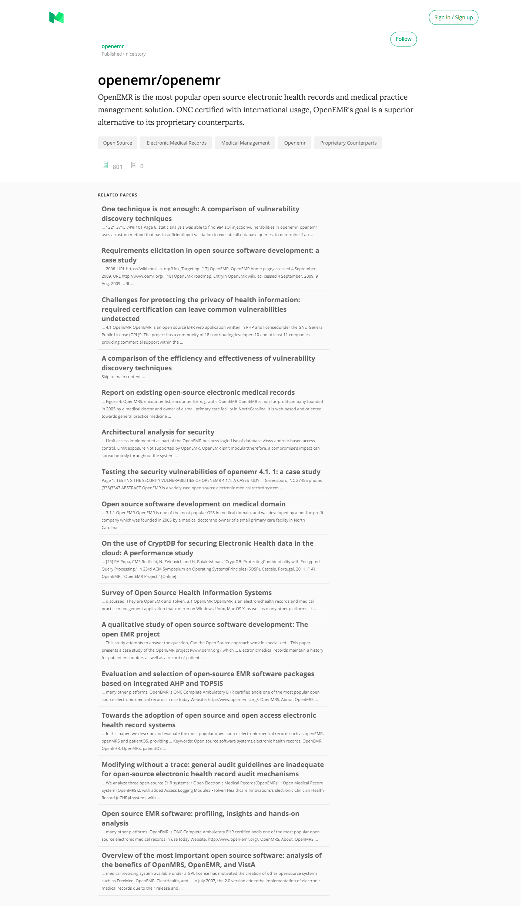
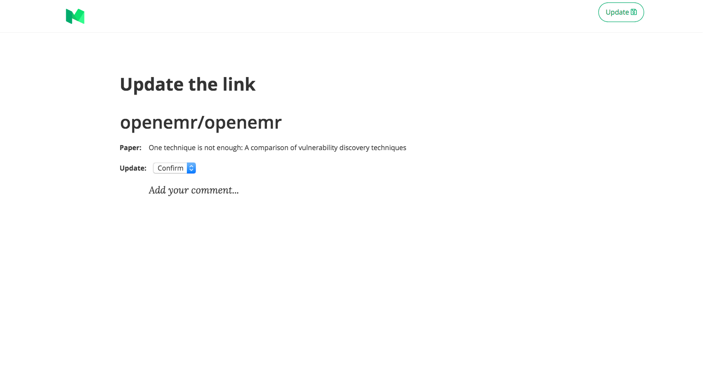

# LOCATE
This is a web application built using [React.js](https://reactjs.org), [Redux](https://redux.js.org), and [Node.js](https://nodejs.org). It enables users to explore related literature for a given open-source clinical software.

# Technologies

1. [React.js](https://reactjs.org)
1. [Redux](https://redux.js.org)
1. [create-react-app](https://github.com/facebook/create-react-app)
1. [Express.js](https://expressjs.com)
1. [Node.js](https://nodejs.org)
1. [MongoDB](https://mongodb.com)

### Features
- Search open-source clinical software
- Social Sign-in
- Check related papers of a given clinical software
- Give feedback of related papers by updating them

### Installation
* Git clone this repo [here](https://github.com/ianshan0915/locate).
* Move into the folder from your terminal:
```sh
    cd locate
```
* Run `npm install` to install node dependencies.
* Start MongoDB instance: `mongod`.
* Run `npm run dev` to start the `nodeidon` daemon.

## App Screenshots

### **Article View**



### **Feed**



### **Profile**


### **SignInWith Google**


### Contributing
1. Create an issue. First look through [the open issues](https://github.com/ianshan0915/locate/issues).
1. Clone the repository or fork it.

         git clone https://github.com/ianshan0915/locate


1. Create your feature branch:

         git checkout -b new-feature

1. Commit your changes:

         git commit -m 'Add some feature'

1. Push to the branch:

         git push origin new-feature

1. Submit a pull request.

- Issue Tracker: https://github.com/ianshan0915/locate/issues
- Source Code: https://github.com/ianshan0915/locate